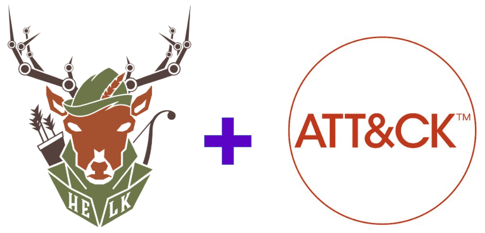
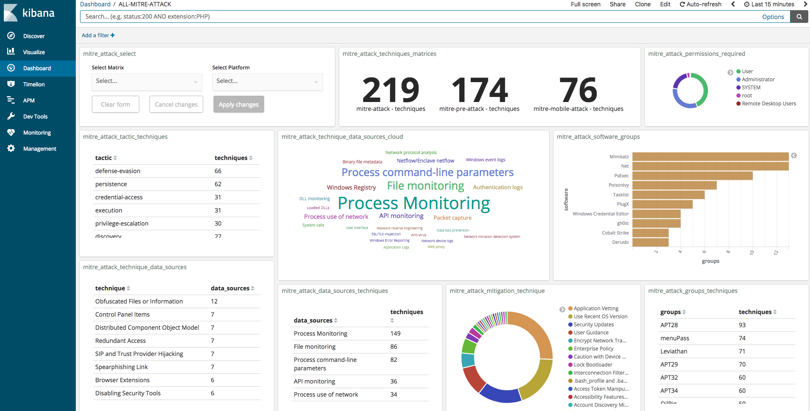
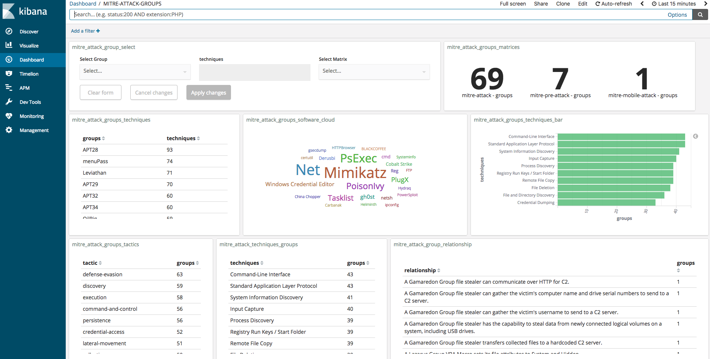

# HELK CTI

Integrating [@MITREattack](https://twitter.com/MITREattack) CTI with [@THE_HELK](https://twitter.com/THE_HELK)



# Goals

* Provide an easy way to explore and interact with up to date ATT&CK content available in STIX via public TAXII server
* Take advantage of Elasticsearch and Kibana's open-source full-text search and analytics engine available in the [HELK](https://github.com/Cyb3rWard0g/HELK)
* Help security analysts during the transition from the ATT&CK MediaWiki API to the STIX/TAXII 2.0 API
* Learn how to integrate ATT&CK data with an open source project

# Current Status: Alpha

The project is currently in an alpha stage, which means that the code and the functionality are still changing. We haven't yet tested the system with large data sources and in many scenarios. We invite you to try it and welcome any feedback.

# HELK CTI Additional Features

* **attackcti:** A Python module to access up to date ATT&CK content available in STIX via public TAXII server. This project leverages the python classes and functions of the [cti-python-stix2](https://github.com/oasis-open/cti-python-stix2) and [cti-taxii-client](https://github.com/oasis-open/cti-taxii-client) libraries developed by MITRE.
* **Elasticsearch:** A highly scalable open-source full-text search and analytics engine.
* **Logstash:** A data collection engine with real-time pipelining capabilities.
* **Kibana:** An open source analytics and visualization platform designed to work with Elasticsearch.

# Resources

* [HELK](https://github.com/Cyb3rWard0g/HELK)
* [ATTACK-PYTHON-CLIENT](https://github.com/Cyb3rWard0g/ATTACK-Python-Client)
* [attackcti library](https://pypi.org/project/attackcti/)
* [MITRE CTI](https://github.com/mitre/cti)
* [OASIS CTI TAXII Client](https://github.com/oasis-open/cti-taxii-client)
* [OASIS CTI Python STIX2](https://github.com/oasis-open/cti-python-stix2)
* [MITRE ATT&CK Framework](https://attack.mitre.org/wiki/Main_Page)

# Getting Started

## Minimal Requirements

* OS: Linux (Ubuntu Server 16.04)
* Memory Size: 8GB
* Disk Size: 50GB

## Git Clone

```
git clone https://github.com/Cyb3rWard0g/ATTACK-Python-Client
```

## Run Install Script

The script will automatically install docker and docker-compose for you. Then, it will build the docker containers

```
cd ATTACK-Python-Client/integrations/helk_cti
sudo ./install-helk-cti.sh
```

You should get a similar output than the one from HELK. Remember this is the integration of ATT&CK CTI with the HELK which will be available also in the main build.

```
************************************************
**           HELK CTI Integration             **
**                                            **
** Author: Roberto Rodriguez (@Cyb3rWard0g)   **
** Author: Jose Luis Rodriguez (@Cyb3rPandaH) **
** HELK CTI version: 0.1.0 (BETA)             **
** HELK ELK version: 6.3.0                    **
** License: BSD 3-Clause                      **
************************************************
 
[HELK-CTI-INSTALLATION-INFO] Obtaining current host IP..
[HELK-CTI-INSTALLATION-INFO] HELK IP set to 192.168.64.131
[HELK-CTI-INSTALLATION-INFO] HELK identified Linux as the system kernel
[HELK-CTI-INSTALLATION-INFO] Checking distribution list and version
[HELK-CTI-INSTALLATION-INFO] You're using ubuntu version xenial
[HELK-CTI-INSTALLATION-INFO] Docker is not installed
[HELK-CTI-INSTALLATION-INFO] Checking if curl is installed first
[HELK-CTI-INSTALLATION-INFO] curl is already installed
[HELK-CTI-INSTALLATION-INFO] Installing docker via convenience script..
[HELK-CTI-INSTALLATION-INFO] Docker-compose is not installed
[HELK-CTI-INSTALLATION-INFO] Checking if curl is installed first
[HELK-CTI-INSTALLATION-INFO] curl is already installed
[HELK-CTI-INSTALLATION-INFO] Installing docker-compose..
[HELK-CTI-INSTALLATION-INFO] Dockerizing HELK..
[HELK-CTI-INSTALLATION-INFO] Building & running HELK via docker-compose
 
 
***********************************************************************************
** [HELK-CTI-INSTALLATION-INFO] YOUR HELK CTI IS READY                               **
** [HELK-CTI-INSTALLATION-INFO] USE THE FOLLOWING SETTINGS TO INTERACT WITH THE HELK **
***********************************************************************************
 
HELK KIBANA URL: http://192.168.64.131
HELK KIBANA & ELASTICSEARCH USER: helk
HELK KIBANA & ELASTICSEARCH PASSWORD: hunting
```

## (Docker) Accessing the HELK CTI Images

By default, the HELK's containers are run in the background (Detached). You can see all your docker containers by running the following command:

```
sudo docker ps

CONTAINER ID        IMAGE                        COMMAND                  CREATED             STATUS              PORTS                NAMES
2a5157ff51d0        helkcti_helk-nginx           "./nginx-entrypoint.…"   14 minutes ago      Up 14 minutes       0.0.0.0:80->80/tcp   helk-nginx
abb28ce3164b        helkcti_helk-kibana          "./kibana-entrypoint…"   14 minutes ago      Up 14 minutes       5601/tcp             helk-kibana
16643e3f586a        helkcti_helk-logstash        "/usr/local/bin/dock…"   14 minutes ago      Up 13 minutes       5044/tcp, 9600/tcp   helk-logstash
29672628412b        helkcti_helk-elasticsearch   "/usr/local/bin/dock…"   14 minutes ago      Up 14 minutes       9200/tcp, 9300/tcp   helk-elasticsearch
```

Then, you will just have to pick which container you want to access and run the following following commands:

```
sudo docker exec -ti <image-name> bash
root@2a5157ff51d0:/opt/helk/scripts#
```

## (Docker) Monitoring HELK CTI docker containers

There is no need to access the docker containers to monitor them. You can easily just run the following commands with a specific container:

```
sudo docker logs --follow helk-elasticsearch

[2018-06-14T18:53:39,087][INFO ][o.e.n.Node               ] [helk-1] initializing ...
[2018-06-14T18:53:39,211][INFO ][o.e.e.NodeEnvironment    ] [helk-1] using [1] data paths, mounts [[/ (overlay)]], net usable_space [37.9gb], net total_space [43.8gb], types [overlay]
[2018-06-14T18:53:39,211][INFO ][o.e.e.NodeEnvironment    ] [helk-1] heap size [5.9gb], compressed ordinary object pointers [true]
[2018-06-14T18:53:39,214][INFO ][o.e.n.Node               ] [helk-1] node name [helk-1], node ID [upm8-s7LQfa7tSpLmPiK-A]
[2018-06-14T18:53:39,216][INFO ][o.e.n.Node               ] [helk-1] version[6.3.0], pid[1], build[default/tar/424e937/2018-06-11T23:38:03.357887Z], OS[Linux/4.4.0-87-generic/amd64], JVM[Oracle Corporation/OpenJDK 64-Bit Server VM/10.0.1/10.0.1+10]
[2018-06-14T18:53:39,216][INFO ][o.e.n.Node               ] [helk-1] JVM arguments [-Xms1g, -Xmx1g, -XX:+UseConcMarkSweepGC, -XX:CMSInitiatingOccupancyFraction=75, -XX:+UseCMSInitiatingOccupancyOnly, -XX:+AlwaysPreTouch, -Xss1m, -Djava.awt.headless=true, -Dfile.encoding=UTF-8, -Djna.nosys=true, -XX:-OmitStackTraceInFastThrow, -Dio.netty.noUnsafe=true, -Dio.netty.noKeySetOptimization=true, -Dio.netty.recycler.maxCapacityPerThread=0, -Dlog4j.shutdownHookEnabled=false, -Dlog4j2.disable.jmx=true, -Djava.io.tmpdir=/tmp/elasticsearch.ZHL1Tu8o, -XX:+HeapDumpOnOutOfMemoryError, -XX:HeapDumpPath=data, -XX:ErrorFile=logs/hs_err_pid%p.log, -Xlog:gc*,gc+age=trace,safepoint:file=logs/gc.log:utctime,pid,tags:filecount=32,filesize=64m, -Djava.locale.providers=COMPAT, -Des.cgroups.hierarchy.override=/, -Xms6g, -Xmx6g, -Des.path.home=/usr/share/elasticsearch, -Des.path.conf=/usr/share/elasticsearch/config, -Des.distribution.flavor=default, -Des.distribution.type=tar]
[2018-06-14T18:53:44,613][INFO ][o.e.p.PluginsService     ] [helk-1] loaded module [aggs-matrix-stats]
[2018-06-14T18:53:44,613][INFO ][o.e.p.PluginsService     ] [helk-1] loaded module [analysis-common]
[2018-06-14T18:53:44,613][INFO ][o.e.p.PluginsService     ] [helk-1] loaded module [ingest-common]
[2018-06-14T18:53:44,613][INFO ][o.e.p.PluginsService     ] [helk-1] loaded module [lang-expression]
[2018-06-14T18:53:44,613][INFO ][o.e.p.PluginsService     ] [helk-1] loaded module [lang-mustache]
[2018-06-14T18:53:44,613][INFO ][o.e.p.PluginsService     ] [helk-1] loaded module [lang-painless]
[2018-06-14T18:53:44,613][INFO ][o.e.p.PluginsService     ] [helk-1] loaded module [mapper-extras]
[2018-06-14T18:53:44,613][INFO ][o.e.p.PluginsService     ] [helk-1] loaded module [parent-join]
[2018-06-14T18:53:44,614][INFO ][o.e.p.PluginsService     ] [helk-1] loaded module [percolator]
[2018-06-14T18:53:44,614][INFO ][o.e.p.PluginsService     ] [helk-1] loaded module [rank-eval]
[2018-06-14T18:53:44,614][INFO ][o.e.p.PluginsService     ] [helk-1] loaded module [reindex]
[2018-06-14T18:53:44,614][INFO ][o.e.p.PluginsService     ] [helk-1] loaded module [repository-url]
[2018-06-14T18:53:44,614][INFO ][o.e.p.PluginsService     ] [helk-1] loaded module [transport-netty4]
[2018-06-14T18:53:44,614][INFO ][o.e.p.PluginsService     ] [helk-1] loaded module [tribe]
[2018-06-14T18:53:44,614][INFO ][o.e.p.PluginsService     ] [helk-1] loaded module [x-pack-core]
[2018-06-14T18:53:44,614][INFO ][o.e.p.PluginsService     ] [helk-1] loaded module [x-pack-deprecation]
[2018-06-14T18:53:44,614][INFO ][o.e.p.PluginsService     ] [helk-1] loaded module [x-pack-graph]
[2018-06-14T18:53:44,614][INFO ][o.e.p.PluginsService     ] [helk-1] loaded module [x-pack-logstash]
[2018-06-14T18:53:44,615][INFO ][o.e.p.PluginsService     ] [helk-1] loaded module [x-pack-ml]
[2018-06-14T18:53:44,615][INFO ][o.e.p.PluginsService     ] [helk-1] loaded module [x-pack-monitoring]
[2018-06-14T18:53:44,615][INFO ][o.e.p.PluginsService     ] [helk-1] loaded module [x-pack-rollup]
[2018-06-14T18:53:44,615][INFO ][o.e.p.PluginsService     ] [helk-1] loaded module [x-pack-security]
[2018-06-14T18:53:44,615][INFO ][o.e.p.PluginsService     ] [helk-1] loaded module [x-pack-sql]
[2018-06-14T18:53:44,615][INFO ][o.e.p.PluginsService     ] [helk-1] loaded module [x-pack-upgrade]
[2018-06-14T18:53:44,615][INFO ][o.e.p.PluginsService     ] [helk-1] loaded module [x-pack-watcher]
[2018-06-14T18:53:44,616][INFO ][o.e.p.PluginsService     ] [helk-1] loaded plugin [ingest-geoip]
[2018-06-14T18:53:44,616][INFO ][o.e.p.PluginsService     ] [helk-1] loaded plugin [ingest-user-agent]
```

# HELK Dashboards

## ALL-MITRE-ATTACK



## MITRE-ATTACK-GROUPS



# Author

* Roberto Rodriguez [@Cyb3rWard0g](https://twitter.com/Cyb3rWard0g) [@THE_HELK](https://twitter.com/THE_HELK)
* Jose Luis Rodriguez [@Cyb3rPandaH](https://twitter.com/Cyb3rPandaH)

# Contributors


# Contributing

Feedback is appreciated!! I would love to know if there is anything that the integration is missing. Maybe more data? was it useful??. Let us know! :) #SharingIsCaring

# TO-Do
[ ] Create a dashboard per Matrix (Enterprise, PRE and Mobile)
[ ] Explore Vega Viz with ATT&CK data
